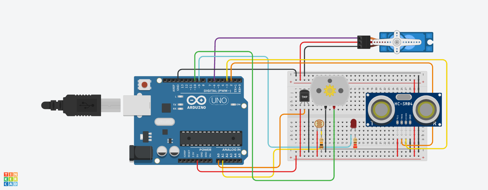

# IoT and Automation System

An Arduino and Node-RED smart-building prototype that monitors temperature, light level, distance, and motion. The system supports automatic and manual control of a light, fan, and servo-operated door through MQTT.



## Features

- Reads a TMP36 temperature sensor, LDR light sensor, and HC-SR04 ultrasonic sensor.
- Automatically switches the light on when the light level is below 30%.
- Automatically switches the fan on when the temperature is above 30 °C.
- Automatically opens the servo door when an object is detected within 100 cm.
- Provides AUTO and MANUAL modes for the light, fan, and door.
- Displays real-time sensor readings and device states in a Node-RED dashboard.
- Exchanges sensor data and control commands through MQTT topics.

## Project Structure

```text
SmartBuildingAutomation.ino  Arduino control and sensor program
flows.json                   Importable Node-RED dashboard flow
mqtt-bridge-v1.js            Tinkercad Serial-to-MQTT bridge
package.json                 Bridge dependencies
smart-building-circuit.png   Circuit diagram
```

## Hardware and Software

### Hardware or simulation components

- Arduino Uno
- TMP36 temperature sensor
- LDR and resistor
- HC-SR04 ultrasonic sensor
- LED and resistor
- DC motor used as a fan
- Servo motor

### Software

- Arduino or Tinkercad Circuits
- Node-RED with Dashboard nodes
- MQTT broker, such as Mosquitto
- Node.js and npm for the optional Tinkercad MQTT bridge

## Setup

1. Build the circuit using `smart-building-circuit.png`.
2. Upload or run `SmartBuildingAutomation.ino`.
3. Start an MQTT broker on `localhost:1883`, or update the broker configuration in Node-RED.
4. In Node-RED, select **Import**, choose `flows.json`, and deploy the flow.
5. Install the bridge dependencies:

   ```bash
   npm install
   ```

6. If using Tinkercad, start the bridge with your circuit URL:

   ```bash
   node mqtt-bridge-v1.js "https://www.tinkercad.com/things/YOUR_CIRCUIT" localhost 1883
   ```

7. Start the Tinkercad simulation and keep its Serial Monitor open.

## Main MQTT Topics

| Topic | Purpose |
|---|---|
| `building/temperature` | Temperature reading in °C |
| `building/light_level` | Light level percentage |
| `building/distance` | Distance reading in centimetres |
| `building/motion` | Motion detection state |
| `building/lightmode` | Select light AUTO or MANUAL mode |
| `building/light/control` | Switch the light ON or OFF |
| `building/fanmode` | Select fan AUTO or MANUAL mode |
| `building/fan/control` | Switch the fan ON or OFF |
| `building/doormode` | Select door AUTO or MANUAL mode |
| `building/door/control` | Open or close the door |

## Acknowledgement

The included Tinkercad MQTT bridge was developed by Rahmad Sadli and is distributed under the MIT licence in `BRIDGE_LICENSE`.
